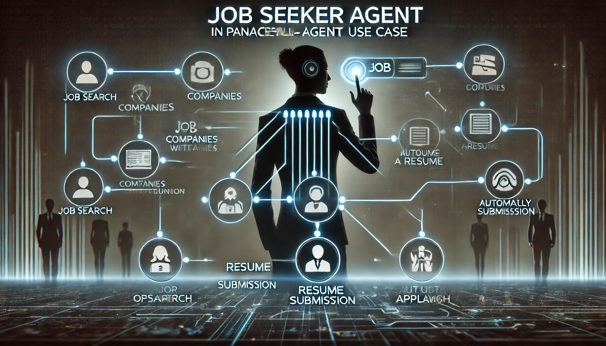

# Job Seeker Agent

## **Overview**

The **Job Seeker Agent** is tailored to assist individuals in automating their job search, application, and networking processes. By leveraging Panacea's multi-agent system, this agent streamlines the journey from identifying potential employers to securing job interviews.

## **Scenario**

**User Query:**
Find all AI companies in New York, identify relevant job openings, and apply to these positions using my resume. Additionally, reach out to contacts within these companies to express my interest.


## **Workflow Breakdown**

1. **Query Interpretation by Orchestrator:**
   - The **Orchestrator** analyzes the natural language query to discern the user's goals:
     - Identifying AI companies in New York.
     - Finding relevant job openings.
     - Automating job applications.
     - Networking with contacts within these companies.

2. **Task Definition and Assignment:**
   - **Task 1:** Identify AI companies located in New York.
     - **Assigned to:** Web Surfer Agent
   - **Task 2:** Find job opportunities within these companies.
     - **Assigned to:** Job Searcher Agent
   - **Task 3:** Automate the job application process.
     - **Assigned to:** Autocode Agent
   - **Task 4:** Network with contacts at these companies.
     - **Assigned to:** Emailer Agent

3. **Agent Collaboration and Execution:**

   ### **Task 1: Company Identification**
   - **Web Surfer Agent** conducts targeted searches to compile a list of AI companies based in New York.
   - It gathers essential details such as company name, size, website, and key contacts.

   ### **Task 2: Job Opportunity Discovery**
   - **Job Searcher Agent** explores each identified company's career page or job boards to find relevant job openings.
   - It extracts information like job titles, descriptions, application deadlines, and requirements.

   ### **Task 3: Job Application Automation**
   - **Autocode Agent** utilizes the user's resume to apply for each identified position.
     - **Steps Involved:**
       - **Resume Parsing:** Extracts relevant information from the user's resume.
       - **Form Filling:** Automatically fills out application forms with the parsed data.
       - **Submission:** Submits the application to the respective job postings.

   ### **Task 4: Networking and Outreach**
   - **Emailer Agent** identifies key contacts within each company, such as hiring managers or team leads, by searching LinkedIn or company directories.
   - It drafts and sends personalized outreach emails to these contacts to express interest and introduce the user's profile.
     - **Example Email:**
       ```
       Subject: Interest in [Job Title] Position at [Company Name]

       Hi [Contact Name],

       I recently applied for the [Job Title] position at [Company Name] and wanted to personally reach out to express my enthusiasm for the opportunity. With my background in [Your Field], I am excited about the prospect of contributing to your team.

       I would love to discuss how my skills and experiences align with your needs. Please let me know if you're available for a brief conversation.

       Thank you for your time and consideration.

       Best regards,
       [Your Name]
       [Your LinkedIn Profile]
       [Your Contact Information]
       ```

4. **Iterative Application and Networking:**
   - The **Autonomous Iteration** process ensures continuous application submissions and networking efforts.
   - Agents monitor responses and schedule follow-up communications as necessary.
   - The system adapts based on feedback, such as adjusting application strategies or refining email templates to improve engagement rates.

## **Detailed Interaction Flow**

### **Step 1: Initial Query**
- **User:** "Find all AI companies in New York, identify relevant job openings, and apply to these positions using my resume. Additionally, reach out to contacts within these companies to express my interest."

### **Step 2: Orchestrator Processing**
- **Orchestrator:**
  - Parses the query to extract key tasks.
  - Defines the workflow and assigns tasks to respective agents.

### **Step 3: Task Execution by Agents**
- **Web Surfer Agent:**
  - Searches for AI-focused companies based in New York.
  - Compiles a list with relevant company details.

- **Job Searcher Agent:**
  - Visits each company's career page.
  - Identifies job openings that match the user's skills and preferences.

- **Autocode Agent:**
  - Automates the application process by uploading the user's resume.
  - Fills out required application fields using extracted data.

- **Emailer Agent:**
  - Identifies and compiles contact information for key personnel within each company.
  - Sends personalized emails to these contacts to initiate networking efforts.

### **Step 4: Continuous Engagement and Optimization**
- **Response Monitoring:**
  - Agents track responses from job applications and outreach emails.

- **Follow-Up Scheduling:**
  - **Emailer Agent** schedules follow-up emails for non-responsive contacts or to further engage interested parties.

- **Strategy Refinement:**
  - Based on response rates, the **Orchestrator** adjusts the outreach strategies.
  - This may include modifying email templates, targeting different job roles, or expanding the search criteria.

## **Benefits**

- **Time-Saving:** Automates the labor-intensive process of job searching and application, allowing users to focus on preparing for interviews.
- **Increased Opportunities:** Maximizes the number of applications submitted, enhancing the likelihood of securing job interviews.
- **Personalized Networking:** Crafts tailored messages to potential employers, increasing the chances of positive responses.
- **Organization:** Maintains a structured record of applications and communications, preventing missed opportunities.
- **Consistency:** Ensures regular follow-ups and persistent engagement without manual effort.

## **Visual Aid**



*Depicts the interaction between the orchestrator and various agents during the job search and application process.*
