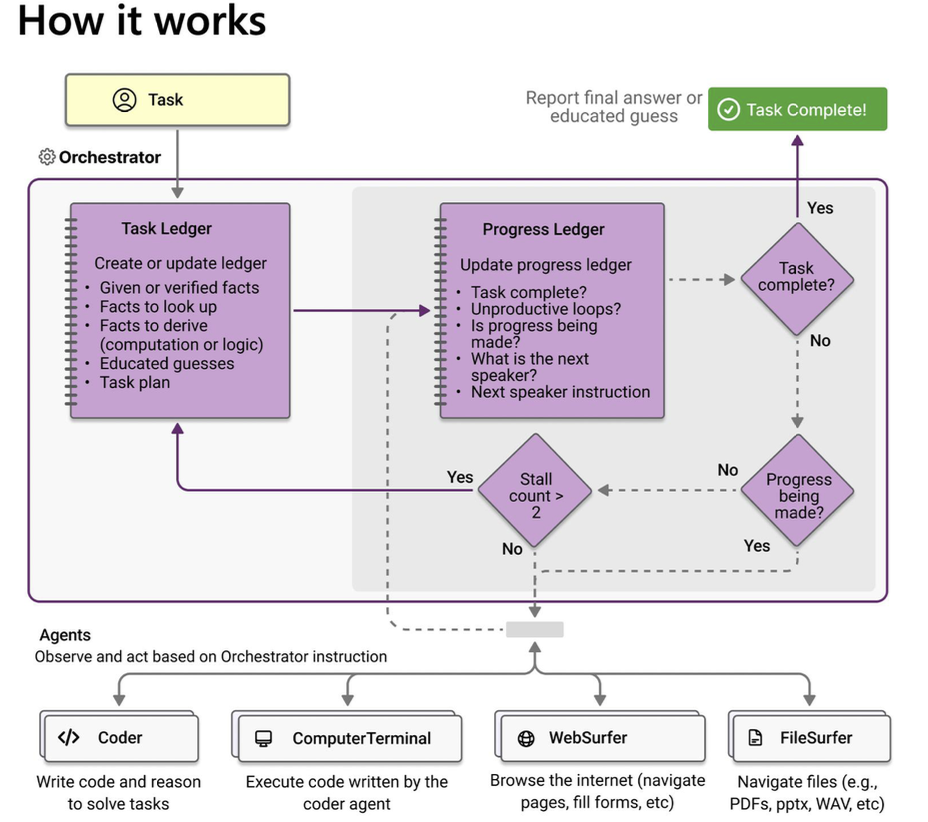

# System Architecture Overview

Our architecture is built around a decentralized network of specialized agents that work both independently and collaboratively. These agents communicate through defined pathways, managed by an orchestrator that ensures tasks are distributed and executed efficiently.

### Key Features

| Feature                    | Description                                                                                     |
|----------------------------|-------------------------------------------------------------------------------------------------|
| **Decentralized Agents** | Each agent operates autonomously while collaborating to achieve complex tasks.                                             |
| **Orchestrator** | Acts as the central command center, managing task distribution and workflow coordination.                                             |
| **Communication Edges** | Enable seamless data exchange and coordination between agents.                                             |
| **Logging & Monitoring**    | Ensure transparency, performance tracking, and issue resolution.                               |
| **Dynamic Workflows** | Build complex workflows with drag-and-drop tools.                                             |
| **Agent Collaboration**    | Enable sequential, parallel, or hierarchical execution of tasks.                               |
| **Customizable Framework** | Integrate third-party apps and tools, such as Slack, AWS, or Google Workspace.                 |
| **Real-Time Debugging**    | Visualize and troubleshoot workflows using interactive flowcharts.                             |
| **Model-Agnostic Design**  | Supports various models, including OpenAI, Claude, Llama, and Mistral.                        |
| **Private Deployments**    | Operate securely in local environments with privacy-preserving configurations.                 |