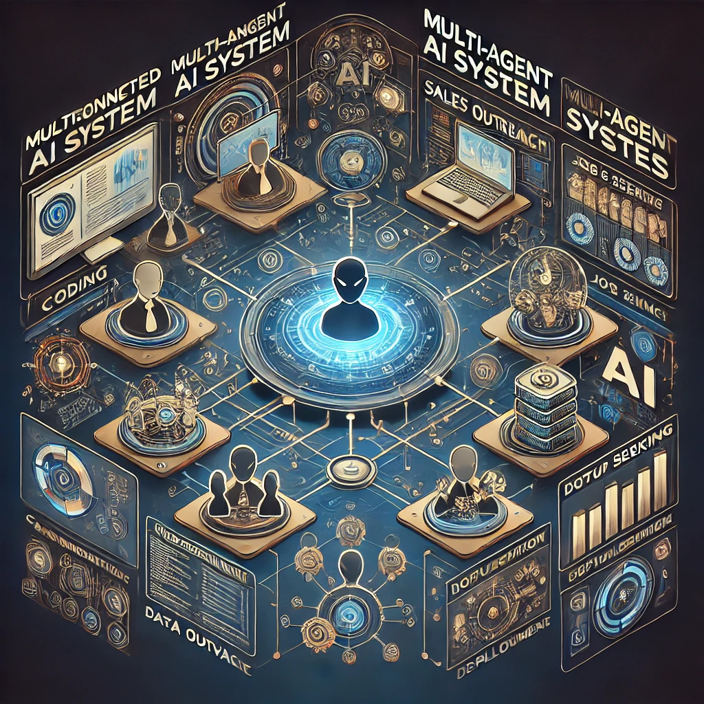

# Communication Framework

Communication between agents is facilitated through edges, which are the defined pathways that enable data exchange and coordination. This framework ensures that agents can work together seamlessly, sharing information and collaborating to complete complex workflows without redundancy or conflict.

## Communication Features

- **Message Passing**: Agents communicate by sending and receiving messages through the edges, ensuring clear and direct information flow.
- **Data Sharing**: Agents can share data outputs and inputs, enabling collaborative task execution and data-driven decision-making.
- **Synchronization**: The framework supports synchronization mechanisms to manage dependencies and ensure orderly task execution.

## Advantages

- **Scalability**: Easily add or remove agents without disrupting the overall system.
- **Flexibility**: Supports various communication protocols to cater to different agent requirements.
- **Resilience**: Enhances system robustness by enabling failover and redundancy in communication pathways.

## Communication Protocols

- **RESTful APIs**: For standard request-response interactions, ensuring compatibility and ease of integration.
- **WebSockets**: Facilitates real-time, bi-directional communication for tasks requiring immediate updates.
- **Message Queues**: Implements reliable message passing with systems like RabbitMQ or Kafka to handle high-throughput data exchange.

## Implementation Highlights

- **Asynchronous Communication**: Ensures non-blocking interactions between agents, enhancing overall system efficiency.
- **Security Measures**: Encrypts all data transmissions to protect sensitive information during inter-agent communication.
- **Monitoring Tools**: Utilizes logging and monitoring systems to track communication flows and identify potential issues.
