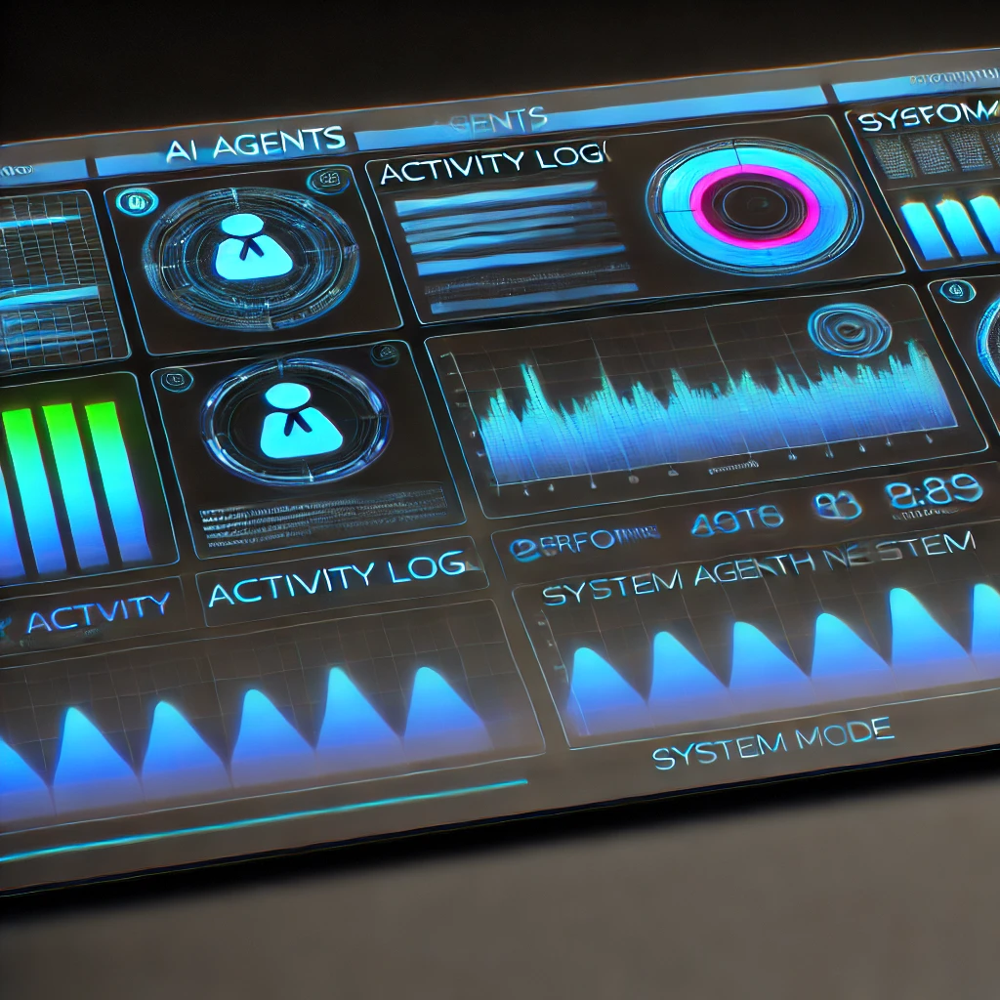
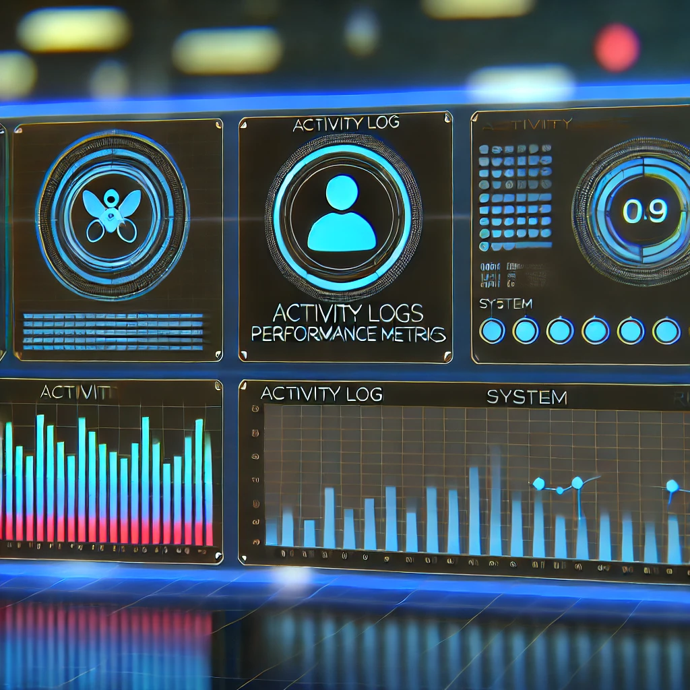

# Logging and Monitoring

Panacea incorporates robust logging and monitoring mechanisms to track the activities and performance of each agent. This transparency allows users to:

- **Monitor Performance**: Keep an eye on how each agent is performing its tasks.
- **Debug Issues**: Quickly identify and resolve any problems that arise.
- **Optimize Workflows**: Use insights from logs to refine and improve workflow processes continuously.

## Logging Features

- **Activity Logs**: Detailed records of agent actions and task executions.
- **Error Logs**: Capture any errors or exceptions encountered by agents.
- **Audit Trails**: Maintain comprehensive audit trails for compliance and accountability.

## Monitoring Tools

- **Real-Time Dashboards**: Visualize agent performance metrics and system status.
- **Alerts and Notifications**: Receive alerts for critical issues, such as task failures or performance bottlenecks.
- **Analytics Reports**: Generate reports to analyze workflow efficiency and agent effectiveness.

## Example Monitoring Dashboard Components

- **Agent Status**: Current status of each agent (active, idle, busy, error).
- **Task Overview**: Summary of tasks in progress, completed, and failed.
- **Performance Metrics**: Data on task completion times, resource utilization, and success rates.
- **System Health**: Indicators of overall system health, including uptime and resource availability.

## Accessing Logs and Reports

- **UI-Based Access**: View logs and monitoring data directly within the Panacea UI.
- **API Access**: Retrieve logs and performance data programmatically through the Developer API.
- **Export Options**: Export logs and reports for offline analysis or integration with other monitoring tools.

## Best Practices

- **Centralized Logging**: Aggregate logs from all agents into a centralized system for easier management and analysis.
- **Regular Reviews**: Periodically review logs and monitoring reports to identify trends and potential areas for improvement.
- **Automated Alerts**: Set up automated alerts for critical metrics to ensure prompt response to issues.
- **Data Retention Policies**: Define data retention policies to manage log storage efficiently while complying with regulatory requirements.

## Tools and Technologies

- **Prometheus**: An open-source monitoring and alerting toolkit used for collecting and storing metrics.
- **Grafana**: A powerful data visualization tool that integrates with Prometheus to create interactive dashboards.
- **ELK Stack (Elasticsearch, Logstash, Kibana)**: A suite of tools for centralized logging, data ingestion, and visualization.
- **Nagios**: A monitoring system that enables organizations to identify and resolve IT infrastructure problems.
- **Datadog**: A cloud-based monitoring and analytics platform for large-scale applications and infrastructure.

## Implementation Highlights

- **Structured Logging**: Use structured logging formats like JSON to facilitate easier parsing and analysis.
- **Granular Metrics**: Collect detailed metrics on agent performance, task execution times, and resource usage.
- **Real-Time Monitoring**: Implement real-time monitoring to detect and respond to issues promptly.
- **Historical Analysis**: Maintain historical logs and metrics to perform trend analysis and capacity planning.

## Support

For assistance with logging and monitoring setup, visit our [Support Center](https://panacea.ai/support) or contact our support team:

- **Email**: support@panacea.ai
- **Phone**: +1 (800) 123-4567
