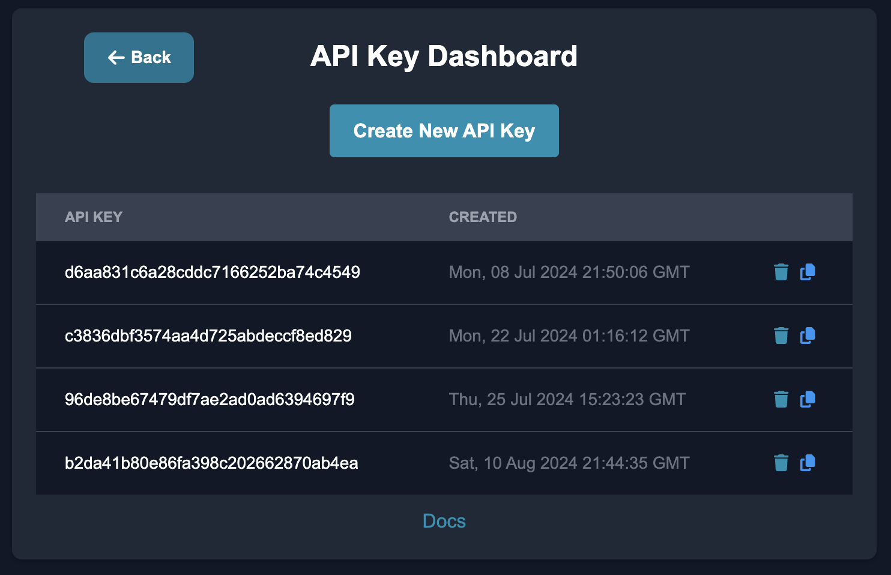

# Overview

The Agents API is a software developer kit designed for developers to leverage LLMs to build teams of agents, and have them collaborate of doing tasks.

## Setup

This setup guide is designed to help get your local development environment setup and send your first API request. Throughout this guide, you will learn:

- How to setup your Anote account
- How to install the Agents Python Pip Package
- How to send your first Agents API request

### Step 1: Account setup

First, create an [Anote](https://anote.ai/) account or sign in. Next, navigate to the API key page and press the **Create new API key** button to generate a new API key.



Copy the API key, and make sure to save this somewhere safe and do not share it with anyone.

### Step 2: Installing Python Pip Package

To use the Anote Python library, you need to have Python installed. To ensure you have Python installed, navigate to your Terminal or Command line:

- MacOS: **Open Terminal:** You can find it in the Applications folder or search for it using Spotlight (Command + Space).

- Windows: **Open Command Prompt:** You can find it by searching "cmd" in the start menu.

Next, enter ```python3 --version``` and then press enter, to ensure you see a python version >3.7.

To install the Private Chatbot Python library from the terminal / command line, run:
``` py
pip install -U anoteagents
```

### Step 3: Sending your first API request

After you have Python configured and set up an API key, the final step is to send a request to the Anote API using the Python library. To do this, create a file named anote-test.py using the terminal or an IDE.

Inside the file, copy and paste the example below:
``` python
from anote-agents import Anote

api_key = 'INSERT_API_KEY_HERE'
```
You should obtain an agent object.


### Bringing It All Together
``` python
from anote-agents import Agent, Task, Crew, Workflow, Tools

api_key = 'INSERT_API_KEY_HERE'
# Simple end-to-end example

# 1) Define an Agent
coordinator = Agent(
    name="VenueCoordinator",
    model="gpt3.5turbo",
    system_prompt="You book event venues in San Francisco.",
    tools=["ScrapeWebsiteTool"],
    verbose=True
)

# 2) Create a Task for that Agent
venue_task = Task(
    instructions="Find a venue for 500 attendees with a budget of $5000.",
    files_uploaded=[],
    expected_output="Brief JSON with venue name, location, cost, capacity.",
    agent=coordinator
)

# 3) Build a Crew
event_crew = Crew(
    agents=[coordinator],
    tasks=[venue_task],
    verbose=True
)

# 4) (Optional) Configure a Workflow
my_workflow = {
    "workflow_type": "sequential",
    "manager_agent": None,
    "allow_parallel": False
}
# In practice, you'd integrate this workflow config into the Crew logic.
```
Key Points: A Tool is typically implemented in Python, but from the Agent’s perspective it’s just a string reference.

```
[CREW] Kicking off tasks...
[VenueCoordinator] Task Instructions: Find a venue for 500 attendees with a budget of $5000.
[VenueCoordinator] Using tools: ['ScrapeWebsiteTool']
[VenueCoordinator] Found a suitable venue under $5000!
Task Result: {
  "venue_name": "Bayview Conference Center",
  "location": "San Francisco",
  "cost": 4000,
  "capacity": 500
}
Crew Execution Completed. All tasks processed.
```

