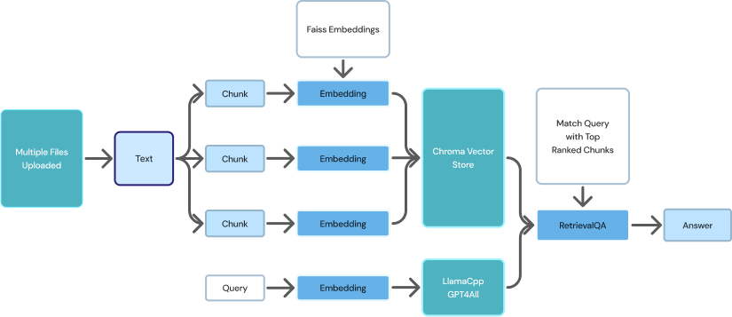

# Introduction to Private Chatbot

Private Chatbot enables enterprises to leverage generative AI and privacy preserving LLMs to chat with their documents while keeping their private and data secure. For context, enterprises want to leverage Generative AI for analytics purposes, but have sensitive data that can not be shared off-premises to LLMs like ChatGPT. Enterprises want to leverage LLMs and Generative AI for analytics, while keeping their data private and secure.

Private Chatbot provides enterprises with their own AI assistant, that can answer any query based on their organizations data. Members of the organization can chat with their documents to ask any question about their organization to obtain relevant insights, and are shown citations of where the answers specifically come from within documents in their enterprise. For enterprises, this can be viewed as an on premise GPT-for-your-business, where enterprises have their own GPT, catered specifically for their needs. Enterprises have no risk of sharing confidential and private data, as both the data and model is kept on premise, local, private and secure.

## How is it Private?

Private Chatbot's paid version is completely private as data, models and chats are all run locally, on device via a desktop app, for enterprise grade security.

### Private Data
- **Uploaded data is stored locally, on premise, for enterprise grade security:** Private Chatbot operates entirely within the user's local environment, providing a secure and private space for document interactions. User documents are stored locally, ensuring that they remain secure on the user's device or local storage infrastructure.

### Private LLMs
- **LLMs like GPT4All and Llama2 run locally on your device.** Private Chatbot employs privacy-aware large language models like LlamaCpp, Mistral and GPT4All, which operate locally on the user's device or local infrastructure. These models preserve user privacy by avoiding the transmission of user queries or documents to external servers.

### Private Chats
- **All queries stay on your computer, never leaving your private, secure data silo.** Private Chatbot ensures that user queries and responses are kept private. When the user asks a question, Private Chatbot incorporates a privacy-preserving retrieval component that efficiently searches and retrieves relevant documents based on user queries. The retrieval process takes place locally, without transmitting sensitive information to external servers.

By combining these principles, Private Chatbot empowers enterprises to chat with their documents in a privacy-preserving way, using the capabilities of generative AI models.

## How Does Private Chatbot Work?

To use Private Chatbot, there are 3 main steps:

### Upload
On Private Chatbot, you can either upload your own documents to a local silo, or connect to financial documents within the EDGAR API.

 **Upload Documents:** User can upload documents such as PDFs, DOCXs, TXTs, PPTXs, etc. locally from their computer.

**Query from EDGAR API:** With the SEC's EDGAR API, users can enter a company ticker and retrieve relevant financial documents.

### Chat
Ask questions on your documents. Get answers and converse with your data. To mitigate hallucinations and ensure the answers are correct, we employ novel research techniques in fine tuning and retrieval augmented generation to provide more accurate answers as well as robust citations.

**Fine Tuning LLMs for Accurate Answers:** To mitigate hallucinations, we leverage parameter efficient fine tuning with techniques such as LORA and Q-LORA for private LLMs such as Llama2. We have benchmarked LLMs with evaluation metrics such as rouge-l, LLM eval, cosine similarity and bleu score, and have shown that fine tuning significantly enhances the accuracy of the answers for your specific dataset.

**Enhanced Retrieval for Accurate Citations:** To mitigate hallucinations, you can view the text from the specific document and page number where the model's answer came from. To ensure our model finds the right chunk for the citation, we have done a lot of research on how LLMs use retrieval augmented generation, and have benchmarked a variety of retrieval techniques such as HyDE and FLARE.

### Evaluate

View relevant citations to ensure the models answers are correct, where you can see the specific document, page number and chunk of text where the answer came from. Our team has implemented a variety of evaluation metrics within our developer docs, such as `cosine similarity`, `blue score`, `rouge-l score` for structured documents, as well as `llm eval` and `faithfulness` with ragas for unstructured documents, to accurate benchmark the performance of the LLMs. We evaluate LLMs both from the retrieval perspective of finding the right chunk for citations, as well as from the answer perspective of answering the question correctly.
